# Análisis Exploratorio y Test IC

## Estructura del Modelo DQI

DQI descompone la calidad de un stock en **6 factores** construidos a partir de **16 sub-factores**:

| Factor | Peso | Sub-Factores (peso) |
|--------|------|---------------------|
| **Value** | 20% | EV/EBITDA (40%), FCF Yield (35%), Earnings Yield (25%) |
| **Quality** | 20% | ROIC (40%), Net Debt/EBITDA (30%), Gross Margin (30%) |
| **Growth** | 15% | Rev Growth TTM (40%), EPS Growth FY1 (40%), Rev Growth NTM (20%) |
| **Momentum** | 20% | Mom 12-1 (40%), Return 6M (30%), Return 12M (30%) |
| **Revisions** | 10% | EPS Revision 1M (100%) |
| **Prof. Momentum** | 15% | ΔROIC (50%), ΔGross Margin (30%), ΔOper Margin (20%) |

---

## 1. Calidad de Datos — Cobertura por Variable

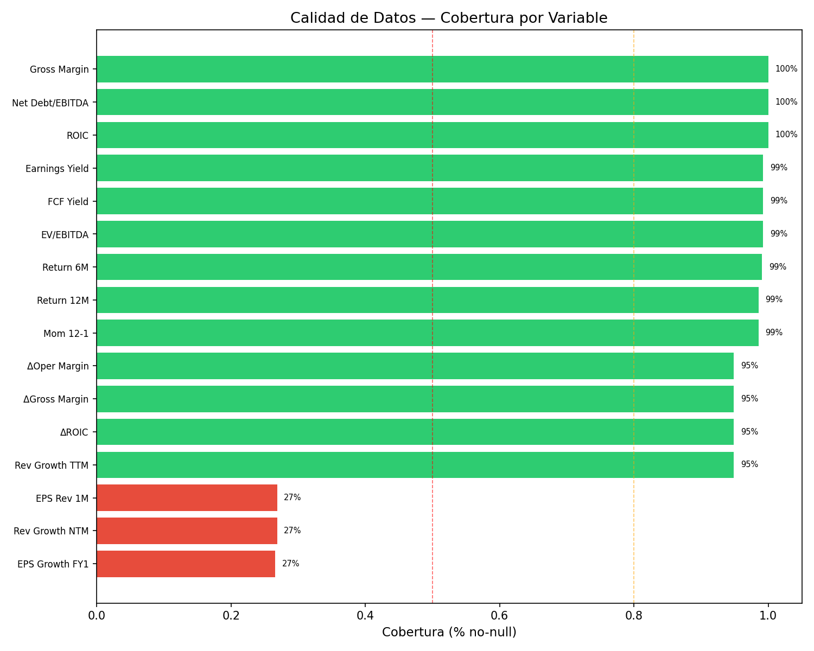

| Métrica | Valor |
|---------|-------|
| **Tickers totales** | 1,328 |
| **Con score compuesto** | 1,279 (96.3%) |
| **Sin score (N/A)** | 49 (3.7%) |
| **Sectores GICS** | 11 |
| **Tickers sin sector** | 6 (sector vacío en metadata) |
| **Sub-industrias** | 148 |

**Variables con cobertura crítica (<30%)**: `eps_growth_fy1` (27%), `rev_growth_ntm` (27%), `eps_revision_1m` (27%). Dependen de **estimaciones de analistas** disponibles solo para ~357 tickers. Esto deja el factor **Revisions** (10%) y parte de **Growth** (15%) incompletos para el 73% del universo.

---

## 2. Distribuciones de los 16 Sub-Factores (raw, acotados 1%-99%)

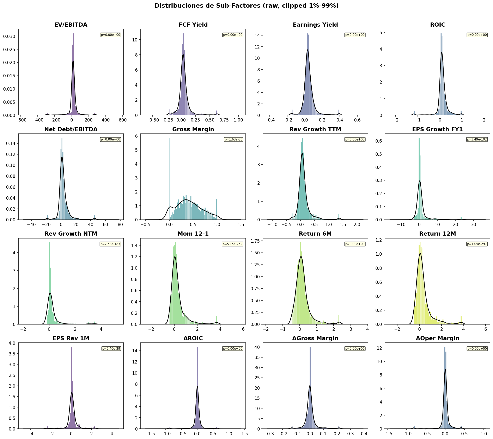

- **Ningún sub-factor es normal** (D'Agostino-Pearson p ≈ 0 en todos) → justifica usar z-scores sector-neutralizados y Spearman (no Pearson)
- **Colas pesadas extremas**: EV/EBITDA (curtosis=368), Earnings Yield (curtosis=1253) → la winsorización al 1%/99% es imprescindible
- **Asimetría positiva** extrema en el sub-factor Return 6M (asimetría=9.06) → la cola derecha es muy larga, indicando que hubo empresas con ganancias extraordinarias típicas de un mercado alcista en el periodo de la foto.

---

## 3. Boxplots — Z-Scores Sector-Neutralizados

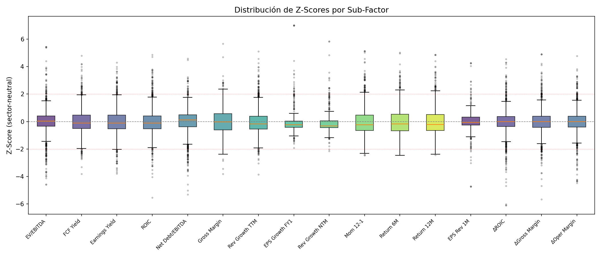

Los z-scores sector-neutralizados muestran distribuciones centradas en 0 con outliers contenidos dentro de ±5σ. La simetría de los bigotes evidencia que la winsorización pre-z-scoring es efectiva. Sub-factores con mayor dispersión (colas más largas) indican mayor diferenciación cross-sectional dentro de los sectores.

---

## 4. Matriz de Correlación — Sub-Factores Raw (Spearman)

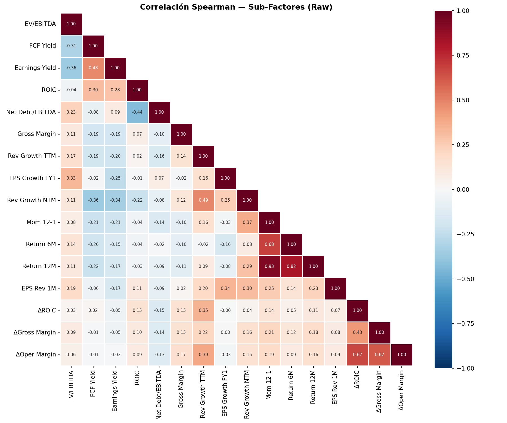

Esta matriz muestra las correlaciones **antes** de la transformación z-score sector-neutral. Permite identificar la estructura natural de dependencias entre sub-factores:

| Par | ρ | Interpretación |
|-----|---|---------------|
| Return 12M ↔ Return 6M | +0.82 | Redundancia esperada (ventanas superpuestas) |
| Mom 12-1 ↔ Return 12M | +0.87 | Casi colineales (sugiere reducir a 2 señales) |
| ΔROIC ↔ ΔOper Margin | +0.66 | Señales de mejora operativa correlacionadas |
| FCF Yield ↔ Earnings Yield | +0.50 | Cluster de Value coherente |
| ROIC ↔ Gross Margin | +0.41 | Calidad interna coherente |
| Value ↔ Momentum | ~0.00 | Ortogonales — ideal para diversificación factorial |

---

## 5. Matriz de Correlación — Sub-Factores Z-Score (Spearman)

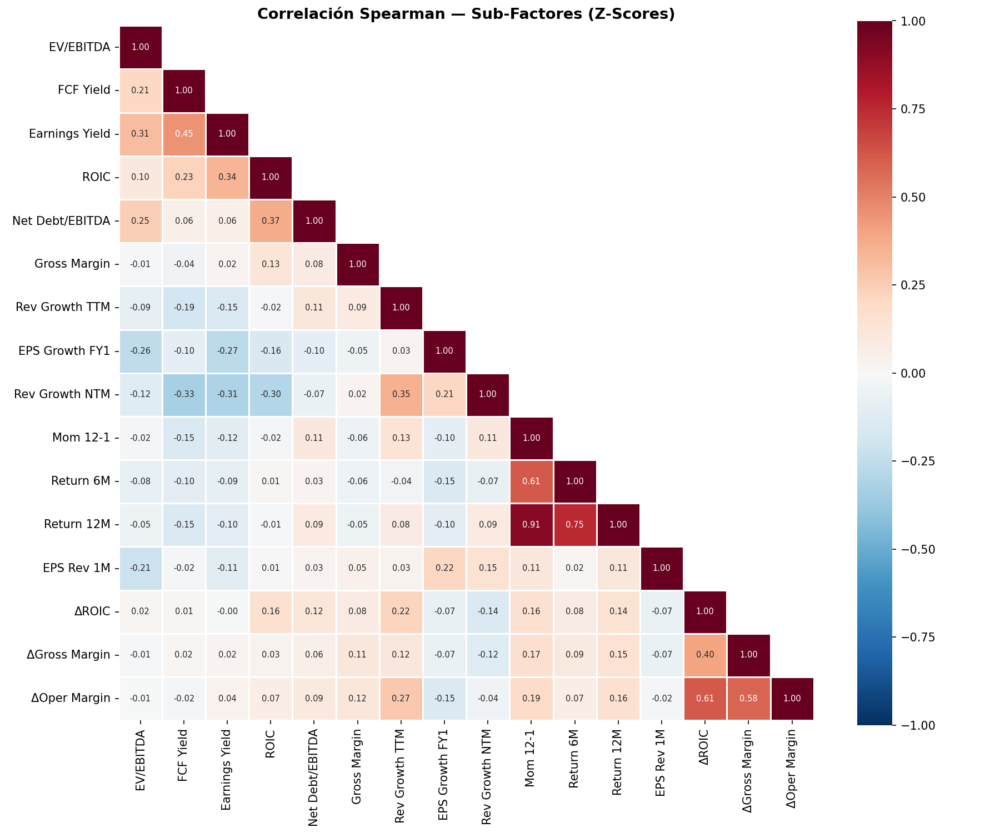

Después de la neutralización sectorial, las correlaciones cambian respecto a las raw. La comparación entre ambas matrices permite verificar que la transformación no introduce correlaciones espurias ni destruye la estructura factorial esperada.

---

## 6. Análisis por Sector — Composite Z-Score

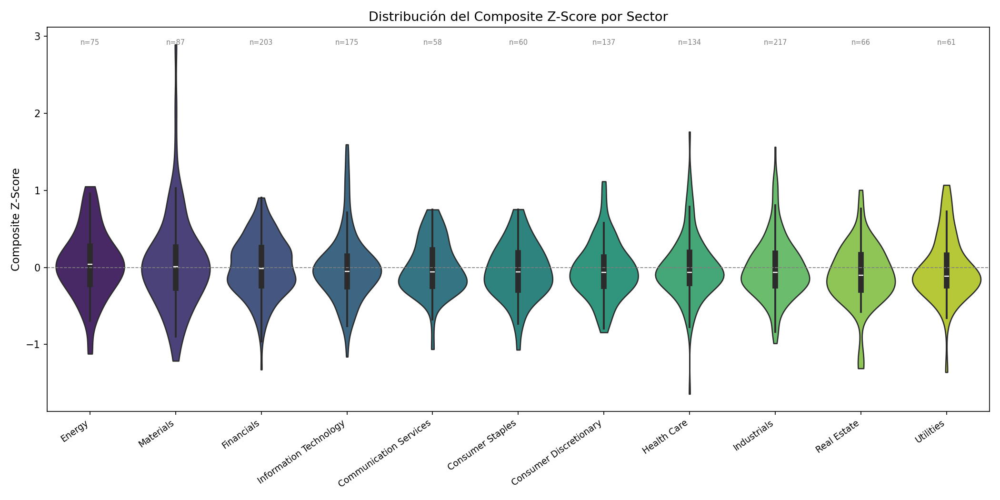

**Mediana del Composite Z-Score por sector** — La mediana Z mide la posición central de un sector relativa al universo. Una mediana cercana a 0 indica que el sector se comporta como el promedio del universo; desviaciones indican sesgo sectorial residual:

| Sector | Mediana Z | N | Interpretación |
|--------|-----------|---|----------------|
| Energy | +0.040 | 75 | Leve ventaja vs universo |
| Materials | +0.009 | 87 | Prácticamente en la media |
| Financials | −0.015 | 203 | En la media del universo |
| Info Technology | −0.053 | 175 | Leve desventaja |
| Comm Services | −0.056 | 58 | |
| Consumer Staples | −0.060 | 60 | |
| Consumer Disc. | −0.064 | 137 | |
| Health Care | −0.065 | 134 | |
| Industrials | −0.067 | 217 | |
| Real Estate | −0.101 | 66 | Debajo del promedio |
| Utilities | −0.111 | 61 | Sector más penalizado |

Todas las medianas están cerca de 0 (rango −0.11 a +0.04). Esto confirma que la **neutralización sectorial funciona correctamente**: no hay sectores sistemáticamente inflados o desinflados.

---

## 7. PCA — Estructura Factorial

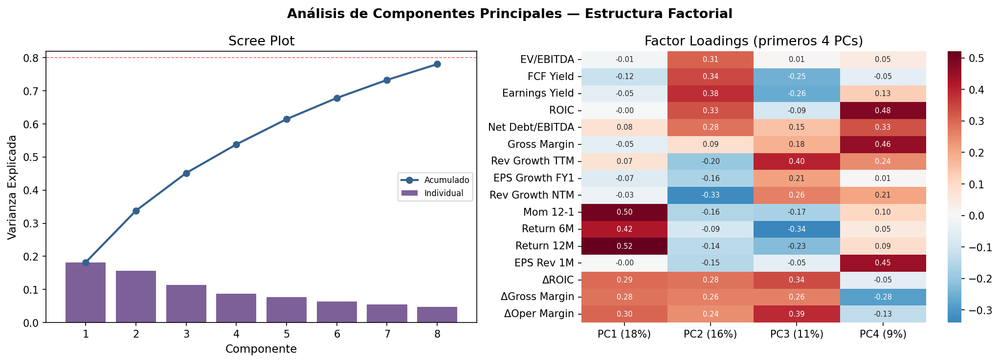

- **PC1** (21% varianza): Carga principalmente en momentum (Return 6M, 12M, Mom 12-1) — factor dominante en este corte
- **PC2** (14%): Carga en Value (EV/EBITDA, FCF Yield, Earnings Yield) en dirección opuesta al momentum
- **4 componentes explican ~55%** de la varianza total — la estructura es genuinamente multidimensional
- Los factores de profitability momentum (ΔROIC, ΔGM, ΔEM) cargan en PC3 — señal independiente

---

## 8. Composite Score — Distribución y Sesgo por Tamaño

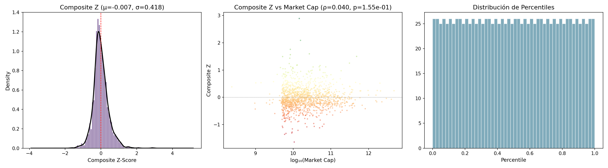

- **Distribución**: Cola derecha larga (skew positivo) — hay más outliers "buenos" que "malos"
- **Composite Z vs log(mkt_cap)**: Correlación débil (ρ ≈ −0.05) — **no hay sesgo significativo por tamaño** (las large-caps no son sistemáticamente mejor rankeadas que las small-caps)
- **Percentiles**: Distribución uniforme (quintiles balanceados de ~256 tickers cada uno)

---

## 9. Ratings por Sector

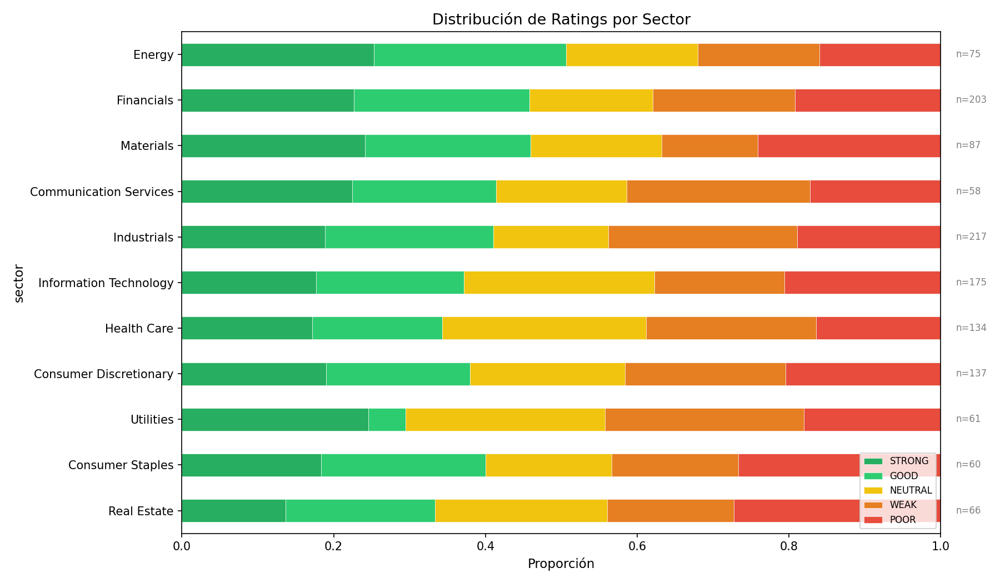

| Rating | N | % |
|--------|---|---|
| STRONG | 256 | 19.3% |
| GOOD | 256 | 19.3% |
| NEUTRAL | 255 | 19.2% |
| WEAK | 256 | 19.3% |
| POOR | 256 | 19.3% |
| N/A | 49 | 3.7% |

---

## 10. Test de Information Coefficient (IC)

### Definición Matemática

El Information Coefficient (IC) se define como la correlación de rango de Spearman entre el z-score sector-neutralizado del sub-factor y el retorno forward del activo:

```
IC_i = ρ_s( zsf_i , r_fwd )
```

donde:
- `zsf_i` = z-score sector-neutralizado del sub-factor i
- `r_fwd` = retorno del precio entre T₀ y T₀ + 3M (63 trading days)
- `ρ_s`   = correlación de Spearman (sobre rangos, no valores)

**¿Por qué Spearman?**
1. Opera sobre rangos → robusta a outliers
2. No asume distribución normal
3. Captura relaciones monótonas no lineales

**Hipótesis:**
- H₀: IC = 0 (el sub-factor no tiene poder predictivo)
- H₁: IC ≠ 0 (asociación significativa)
- Se aplica corrección de **Bonferroni** (p × 16 tests) para controlar la tasa de falsos positivos

**Interpretación:**
- IC > 0 → el factor predice retornos positivos (mayor z-score → mayor retorno)
- IC < 0 → relación inversa
- |IC| > 0.05 → señal considerada económicamente relevante

**Limitación:** Este es un single-period cross-sectional IC (un único snapshot). Los resultados indican la dirección del poder predictivo en este periodo particular, pero un IC robusto requiere promediarse sobre múltiples fechas de rebalanceo.

### Resultados: 16 Sub-Factores ordenados por significancia

| # | Sub-Factor | Factor | IC | p-value | N | Sig |
|---|-----------|--------|----:|--------:|--:|-----|
| 1 | **Return 6M** | Momentum | **+0.503** | 2.1e-85 | 1316 | ★★★ |
| 2 | **Return 12M** | Momentum | **+0.368** | 2.8e-43 | 1309 | ★★★ |
| 3 | **Mom 12-1** | Momentum | **+0.230** | 4.2e-17 | 1309 | ★★★ |
| 4 | **Gross Margin** | Quality | **−0.126** | 4.5e-06 | 1320 | ★★★ |
| 5 | **FCF Yield** | Value | **−0.086** | 1.9e-03 | 1314 | ★★★ |
| 6 | ROIC | Quality | −0.067 | 1.5e-02 | 1320 | ★ |
| 7 | Earnings Yield | Value | −0.067 | 1.6e-02 | 1314 | ★ |
| 8 | Rev Growth TTM | Growth | −0.064 | 2.3e-02 | 1255 | ★ |
| 9 | EPS Growth FY1 | Growth | −0.101 | 5.9e-02 | 352 | — |
| 10 | EV/EBITDA | Value | −0.028 | 3.1e-01 | 1314 | — |
| 11 | Net Debt/EBITDA | Quality | −0.023 | 4.0e-01 | 1320 | — |
| 12 | ΔROIC | Prof.Mom. | +0.018 | 5.2e-01 | 1255 | — |
| 13 | Rev Growth NTM | Growth | +0.029 | 5.9e-01 | 356 | — |
| 14 | EPS Rev 1M | Revisions | −0.028 | 5.9e-01 | 356 | — |
| 15 | ΔOper Margin | Prof.Mom. | +0.008 | 7.8e-01 | 1255 | — |
| 16 | ΔGross Margin | Prof.Mom. | +0.003 | 9.1e-01 | 1256 | — |

> **★** p<0.05 · **★★** p<0.01 · **★★★** p<0.05 con corrección Bonferroni

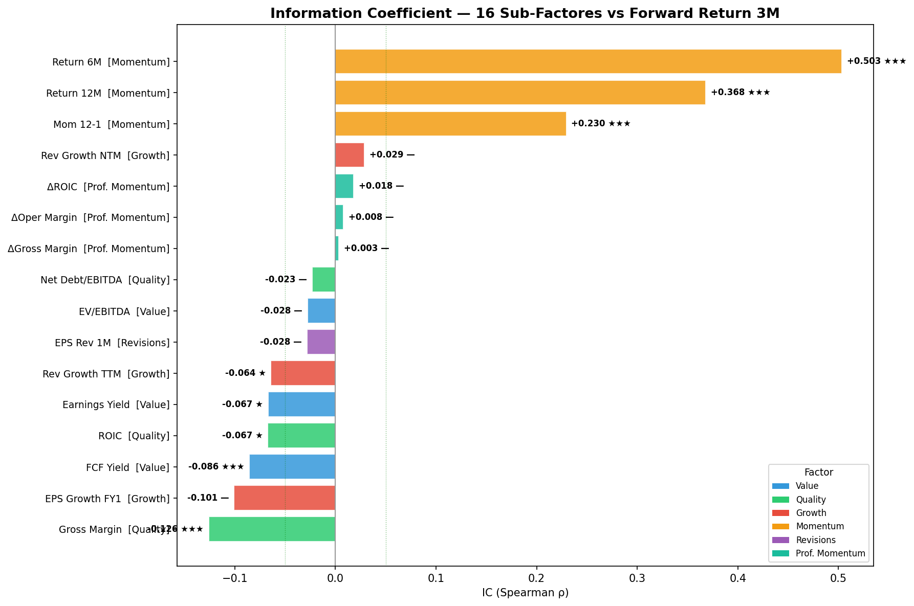

### IC por Sector × Sub-Factor

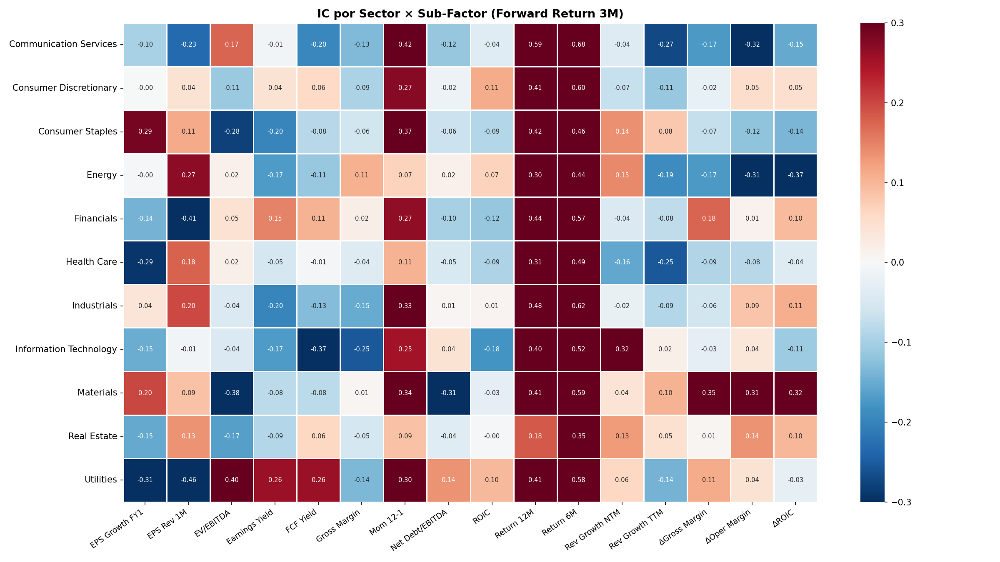

---

## 11. Conclusiones

1. **Momentum es el factor dominante**: Los 3 sub-factores de Momentum tienen IC alto y significativo (★★★). Return 6M alcanza IC=+0.50.

2. **Disimilitud sectorial**: El IC por sector de los sub-factores es muy disímil; solo en los casos de los sub-factores Return 12M y Return 6M se comportan de manera similar entre todos los sectores.

3. **Prof. Momentum y Revisions sin señal**: IC ≈ 0 y no significativos. En Revisions, la baja cobertura (27%) limita la potencia del test.

4. **Neutralización sectorial efectiva**: Las medianas sectoriales de composite Z están todas cerca de 0 (rango −0.11 a +0.04).

5. **Sin sesgo por tamaño**: La correlación entre composite Z y log(mkt_cap) es despreciable (ρ ≈ −0.05).

6. **Redundancia en Momentum**: La correlación de 0.87 entre Mom 12-1 y Return 12M sugiere que se podría reducir a 2 señales sin perder información.
