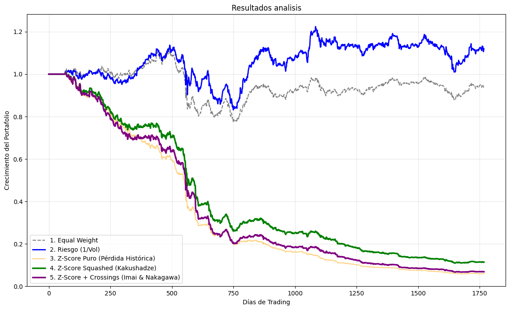

# Optimización de Capital en Arbitraje Estadístico
**Un análisis cuantitativo de estrategias de asignación de pesos en Pair Trading**

---

## 1. Presentación del Problema
**El desafío de la asignación de capital**

El problema central de nuestra investigación es: **¿Cómo distribuimos el capital de forma dinámica para maximizar las ganancias?** 

---

## 2. Hiperparámetros del Modelo
**Calibración del motor de señales**

Previo a la fase de ponderación de capital, la generación de señales operó bajo los siguientes parámetros fijos:

* **Ntraining:** 1000 días (ventana para el cálculo inicial de cointegración).
* **beta_win:** 61 días (ventana móvil para el ratio de cobertura $\beta$).
* **zscore_win:** 31 días (ventana móvil para normalizar el spread).
* **sigma_co:** Umbral de entrada en $\pm 1.5$ desviaciones estándar.
* **sigma_ve:** Umbral de salida (cierre) en $\pm 0.1$ desviaciones estándar.

---

## 3.1 Modelos Matemáticos de Asignación: Intensidad de Alpha
**Fórmulas y revisión de la literatura**

*(Fuente: Isichenko, 2021)*

$$\omega_{i,t} = \frac{|Z_{i,t}|}{\sum_{j=1}^N |Z_{j,t}|}$$

**Definición de variables:**
* $\omega_{i,t}$: Peso relativo (fracción del capital total) asignado al par $i$ en el día $t$.
* $|Z_{i,t}|$: Valor absoluto del Z-Score (magnitud de la desviación) del par $i$ en el día $t$.
* $N$: Número total de pares activos en el portafolio ($N=10$).
* $j$: Índice iterador que representa a cada uno de los $N$ pares del portafolio.
* $\sum_{j=1}^N |Z_{j,t}|$: Sumatoria de los Z-Scores absolutos de todos los pares en el día $t$. Actúa como factor de normalización para asegurar que la suma de todos los pesos ($\omega$) sea exactamente 1 (100% del capital invertido).

*Hipótesis del modelo:* A mayor magnitud de desviación matemática, mayor es la expectativa de rebote.

---

## 3.2 Modelos Matemáticos de Asignación: Paridad de Riesgo
**Fórmulas y revisión de la literatura**

*(Fuente: Kakushadze, 2014)*

$$\omega_{i,t} = \frac{1 / \sigma_i}{\sum_{j=1}^N (1 / \sigma_j)}$$

**Definición de variables:**
* $\omega_{i,t}$: Peso relativo (fracción de capital) asignado al par $i$ en el día $t$.
* $\sigma_i$: Volatilidad histórica (desviación estándar) del *spread* del par $i$. 
* $1 / \sigma_i$: Inversa de la volatilidad del par $i$, utilizada como métrica de estabilidad.
* $N$: Número total de pares activos en el portafolio ($N=10$).
* $j$: Índice iterador para recorrer todos los pares.
* $\sigma_j$: Volatilidad histórica del *spread* del par $j$.
* $\sum_{j=1}^N (1 / \sigma_j)$: Sumatoria de las inversas de las volatilidades de todos los pares, utilizada para normalizar los pesos al 100% del capital.

*Hipótesis del modelo:* Ignora la magnitud de la señal y busca normalizar la varianza del residual para maximizar el Ratio de Sharpe, castigando a los pares inestables.

---

## 3.3 Modelos Matemáticos de Asignación: Z-Score "Squasheado"
**Fórmulas y revisión de la literatura**

*(Fuente: Kakushadze, 2014)*

$$\omega_{i,t} = \frac{\tanh(|Z_{i,t}| / \kappa) / \sigma_i}{\sum_{j=1}^N \tanh(|Z_{j,t}| / \kappa) / \sigma_j}$$

**Definición de variables:**
* $\omega_{i,t}$: Peso relativo (fracción de capital) asignado al par $i$ en el día $t$.
* $\tanh$: Función matemática tangente hiperbólica (acota cualquier valor hacia un límite máximo de 1).
* $|Z_{i,t}|$ y $|Z_{j,t}|$: Valor absoluto del Z-Score de los pares $i$ y $j$ respectivamente, en el día $t$.
* $\kappa$: Constante de escalamiento que suaviza la curva (fijada en $\kappa = 2.0$).
* $\sigma_i$ y $\sigma_j$: Volatilidad histórica del *spread* de los pares $i$ y $j$.
* $N$: Número total de pares en el portafolio ($N=10$).

*Hipótesis del modelo:* La función no lineal limita asintóticamente el capital asignado en divergencias extremas (*outliers*), protegiendo la cuenta en caso de rupturas estructurales.

---

## 3.4 Modelos Matemáticos de Asignación: Crossing Statistics
**Fórmulas y revisión de la literatura**

*(Fuente: Imai & Nakagawa, 2020)*

$$\omega_{i,t} = \frac{(|Z_{i,t}| \times C_i) / \sigma_i}{\sum_{j=1}^N (|Z_{j,t}| \times C_j) / \sigma_j}$$

**Definición de variables:**
* $\omega_{i,t}$: Peso relativo (fracción de capital) asignado al par $i$ en el día $t$.
* $|Z_{i,t}|$ y $|Z_{j,t}|$: Valor absoluto del Z-Score de los pares $i$ y $j$.
* $C_i$ y $C_j$: Métrica de "Crossing Statistics" de los pares $i$ y $j$. Representa la tasa histórica (frecuencia) con la que el *spread* de ese par cruza la línea de cero.
* $\sigma_i$ y $\sigma_j$: Volatilidad histórica del *spread* de los pares $i$ y $j$.
* $N$: Número total de pares en el portafolio ($N=10$).

*Hipótesis del modelo:* Ponderar la intensidad de la señal por la frecuencia histórica de cruces por cero permite filtrar y descartar los spreads que se han quedado estancados en una tendencia direccional.

---

## 3.5 Implementación de los Pesos ($\omega$)

```python
    # 1. EQUAL WEIGHT (Base)
    w_eq = np.abs(positions)
    sum_eq = w_eq.sum(axis=0); sum_eq[sum_eq == 0] = 1
    w_eq = w_eq / sum_eq

    # 2. RIESGO 1/Vol (Kakushadze)
    w_risk = np.abs(positions) / (spread_vols[:, None] + 1e-8)
    sum_risk = w_risk.sum(axis=0); sum_risk[sum_risk == 0] = 1
    w_risk = w_risk / sum_risk

    # 3. Z-SCORE (Isichenko)
    w_int = np.abs(positions * z_matrix)
    sum_int = w_int.sum(axis=0); sum_int[sum_int == 0] = 1
    w_int = w_int / sum_int

    # 4. Z-SCORE "SQUASHEADO" (Kakushadze Tanh)
    z_squashed = np.tanh(np.abs(z_matrix) / 2.0)
    w_z_squash = (np.abs(positions) * z_squashed) / (spread_vols[:, None] + 1e-8)
    sum_z_squash = w_z_squash.sum(axis=0); sum_z_squash[sum_z_squash == 0] = 1
    w_z_squash = w_z_squash / sum_z_squash

    # 5. Z-SCORE + CROSSING STATISTICS (Imai & Nakagawa)
    w_z_cross = (np.abs(positions * z_matrix) * crossings_rate[:, None]) / (spread_vols[:, None] + 1e-8)
    sum_z_cross = w_z_cross.sum(axis=0); sum_z_cross[sum_z_cross == 0] = 1
    w_z_cross = w_z_cross / sum_z_cross
```
---
## 4.1 Medición del Capital: Retorno Individual
**Fórmula Matemática (Retorno Individual del Par $i$):**
$$R_{i,t} = \frac{Cap_{i,t} - Cap_{i,t-1}}{Cap_{i,t-1}}$$

**Implementación en Código:**

```python
# Iteramos sobre la lista de resultados (res_l)
for i, res_d in enumerate(res_l):
    
    # 1. Extraemos el capital nominal generado por las señales de este par
    cap = np.array(res_d.get('capital', np.ones(n_days)))

    # 2. Aplicamos la fórmula matemática: (Hoy - Ayer) / Ayer
    ret = np.nan_to_num(np.diff(cap) / (cap[:-1] + 1e-8))

    # 3. Guardamos el resultado en la fila correspondiente de la matriz global
    returns[i, -len(ret):] = ret
```

---

## 4.2 Medición del Capital: Retorno del Portafolio
**Matemática de la liquidación y su implementación en Python**

Una vez obtenida la matriz de retornos individuales y la matriz de pesos dinámicos, calculamos el rendimiento global diario sumando el aporte de cada par al portafolio.

**Fórmula Matemática (Retorno Diario del Portafolio):**
$$R_{port,t} = \sum_{i=1}^N \omega_{i,t} \cdot R_{i,t}$$

**Definición de variables:**
* $R_{port,t}$: Rendimiento neto diario del portafolio completo en el día $t$.


**Implementación en Código:**

```python
# Multiplicación elemento a elemento de las matrices y sumatoria por columnas (días)
daily_portfolio_return = np.sum(w_risk * returns, axis=0)
```
---

## 4.3 Medición del Capital: Curva Acumulada

**Fórmula Matemática (Capital Acumulado $V_T$):**
$$V_T = V_0 \prod_{t=1}^T (1 + R_{port,t})$$

**Definición de variables:**
* $V_T$: Valor total acumulado del portafolio al final del período $T$. Representa la curva de capital final que se grafica en los resultados.
* $V_0$: Capital base inicial invertido (fijado en $1.0$ para normalizar los resultados y representar el 100% inicial).
* $\prod_{t=1}^T$: Productoria matemática que itera y multiplica los retornos desde el primer día ($t=1$) hasta el día final de la simulación ($T$).
* $R_{port,t}$: Rendimiento neto diario del portafolio en el día $t$ (obtenido en el paso anterior).

**Implementación en Código:**

```python
# Aplicación del interés compuesto a la serie temporal completa
port_risk = np.cumprod(1 + daily_portfolio_return)
```
---

## 5. Muestra Seleccionada:
**Selección de los 10 pares con menor p-value**

| Ranking | Par de Empresas | p-value |
| :--- | :--- | :--- |
| **Top 1** | DHT vs STNG | 0.000003 |
| **Top 2** | EQT vs SM | 0.000025 |
| **Top 3** | LTBR vs SFL | 0.000110 |
| **Top 4** | CVX vs EOG | 0.000112 |
| **Top 5** | TNK vs FRO | 0.000130 |
| **Top 6** | CLMT vs ASC | 0.000261 |
| **Top 7** | GPRE vs CLNE | 0.000305 |
| **Top 8** | SU vs MTDR | 0.000539 |
| **Top 9** | CTRA vs KOS | 0.000603 |
| **Top 10** | NOG vs OXY | 0.000695 |   

---

## 6. Resultados del Capital
**Comparativa de rendimiento Out-of-Sample (1700 días)**

Partiendo de un capital $V_0 = 1.0$:

1.  **Equal Weight (Base):** 0.9425 (-5.75%)
2.  **Z-Score (Isichenko):** 0.0589 (-94.11%)
3.  **Z-Score + Crossings (Imai & Nakagawa):** 0.0684 (-93.16%)
4.  **Z-Score Squashed (Kakushadze):** 0.1136 (-88.64%)
5.  **Paridad de Riesgo 1/Vol (Kakushadze):** **1.1192 (+11.92%)**

---

## 7. Resultados Gráficos
**Evolución del capital a lo largo de 1700 días**



