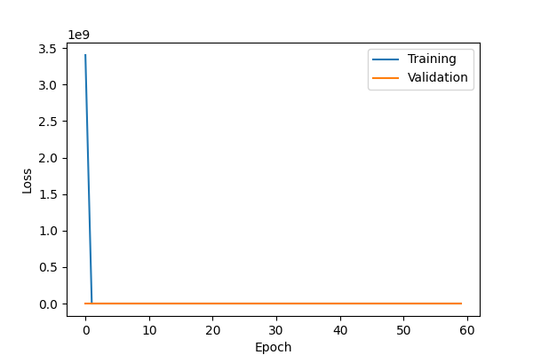
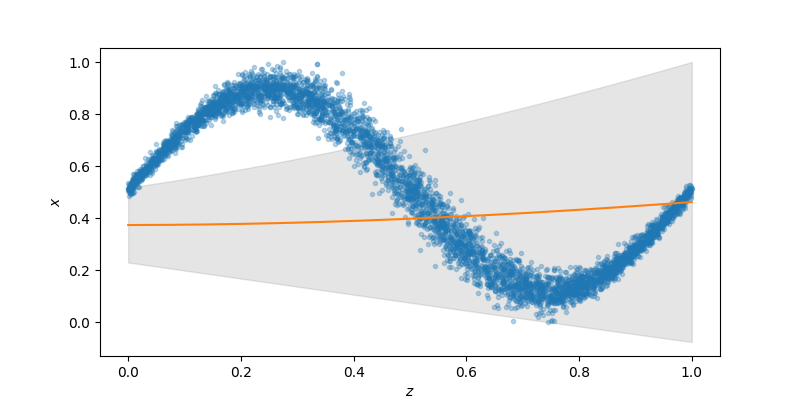
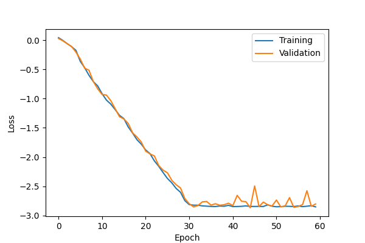
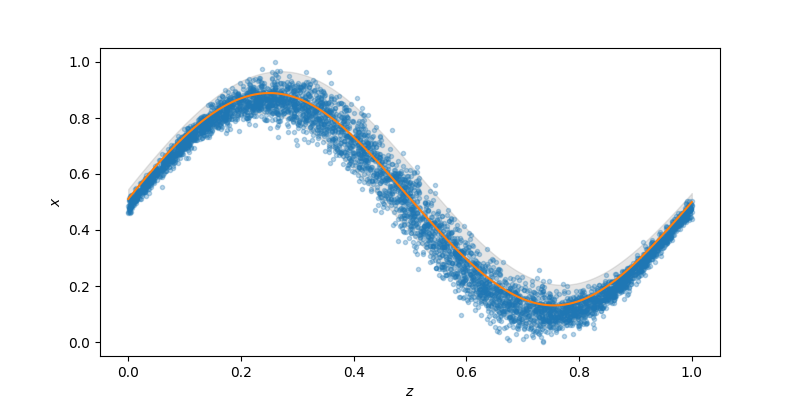
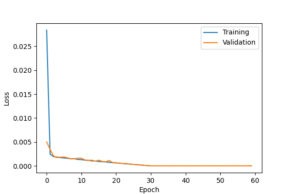
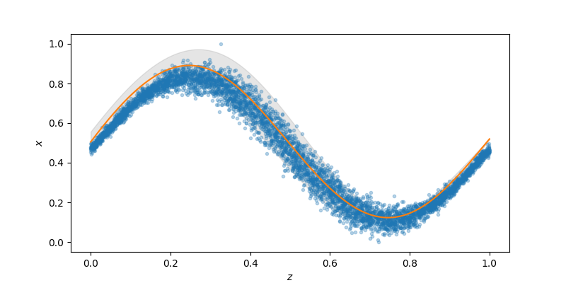
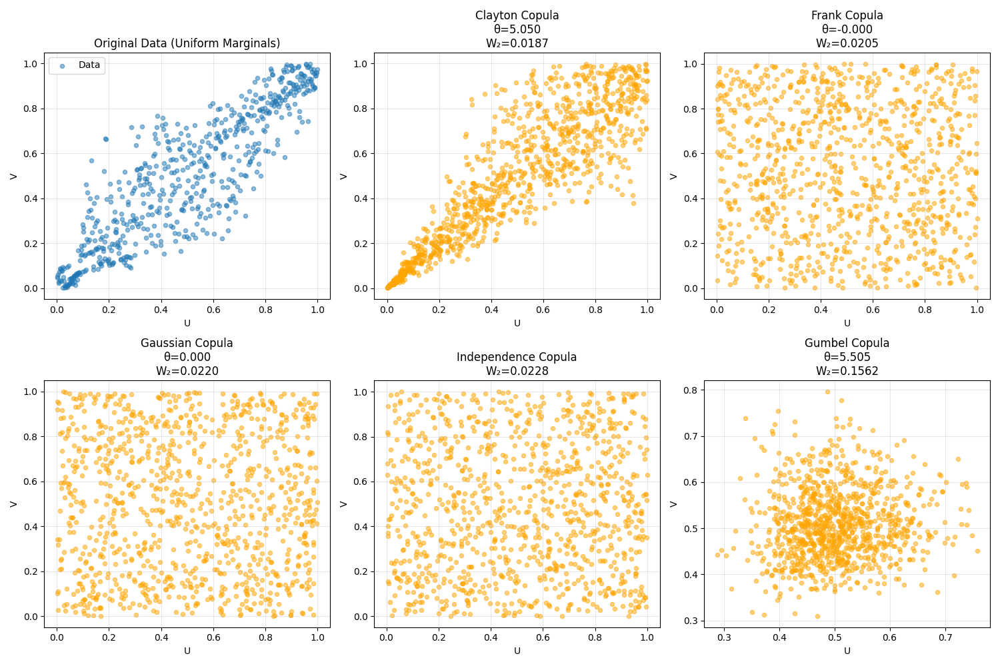

#+TITLE: Implementacion NNs para regresion
#+STARTUP: hidestars
#+STARTUP: overview
#+LATEX_CLASS: myarticle

* Entrenamiento red  neuronal para regresion. Caso teorico

Dado $z$ quiero estimar $x$, en particular su media $\mu_x$  y su desviacion standard $\sigma_x$.

Es decir la red neuronal debe predecir una Gaussiana parametricamente.

Arquitectura de la red sencilla: FCNN (Hidden 64x32) activation function GELU (smooth ReLU). 

Funcion de perdida: Necesitamos sensibilidad a $\sigma_x$

\begin{itemize}
\item Negativo de la log verosimilitud  $ - log L = - log \prod_j^N p(x_j|z_j) =   \frac{N}{2} \log \sigma(z)^2  \frac{1}{2\sigma(z)²} \sum_{j=1}^N \left(x - \mu_x\right)^2
\item Extended MSE:  $ (1-\lambda) (x-\mu_x(z))^2 + \lambda \left[\sigma_x(z)^2 -  (x-\mu_x(z))^2 \right]^2$
 donde $(x-\mu_x)^2$ son los residuales o error de prediccion (de la media).
\end{itemize}

** Log-likelihood

** Mixed MSE - Log-likelihood

** Mixed MSE - eMSE

* Red neuronal para activos sinteticos

** Usando Log-lik

./fig/prediction_syn_assets_mixed_nll.png

./fig/zcore_syn_assets_mixed_nll.png

** Usando Extended-MSE

./fig/prediction_syn_assets_mixed_emse.png

./fig/zcore_syn_assets_mixed_emse.png

* Transporte optimo como distancia

Tenemos una muestra sintetica (generada por una distribucion propuesta) y tenemos la muestra de los datos. 

Concepto. Queremos medir cuan distintas son las muestras.

Para estos se transportan las muestras sinteticas hasta las muestras de los datos  (seleccionando pares cercanos) y se mide la distancia de esos transportes.

\rp{Nos permite saber cuan bueno es nuestro modelo, o de dos modelos cual es superior en terminos probabilisticos}

