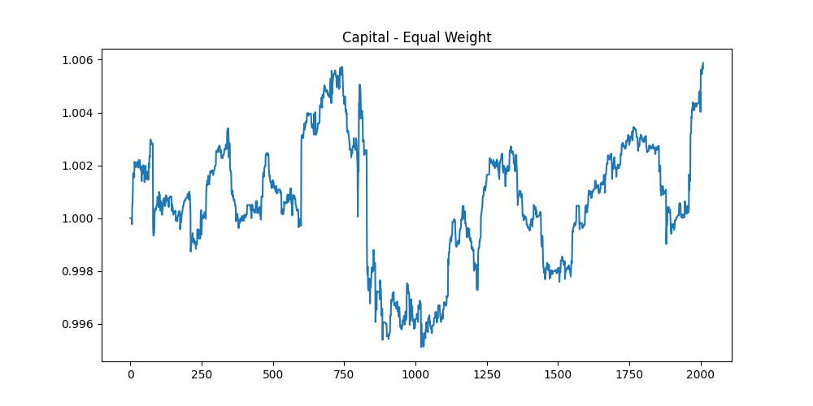
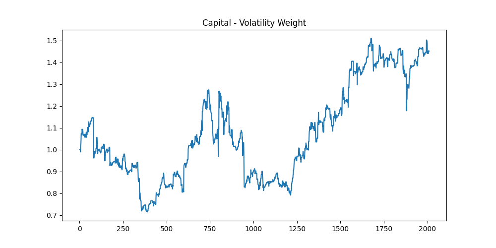
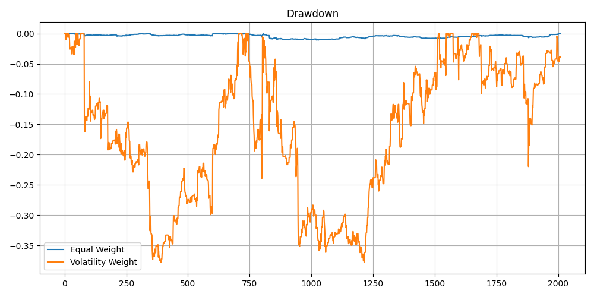
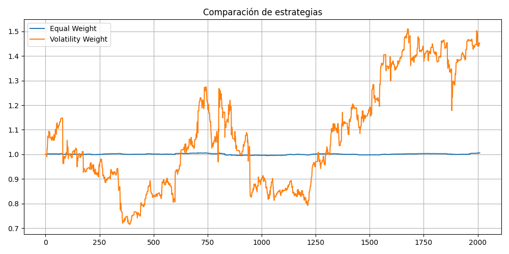
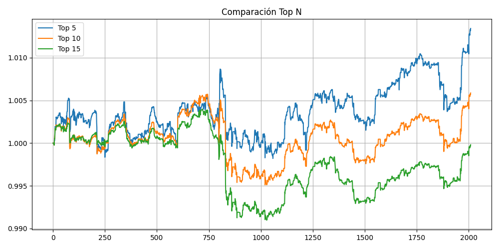

# 📊 Statistical Arbitrage con Pairs Trading y Portfolio Optimization

## Autores
- Clara Cabrera  

---

# 1. Introducción

El presente trabajo tiene como objetivo desarrollar una estrategia de **statistical arbitrage** basada en **pairs trading**, y extenderla hacia un enfoque de **optimización de portafolio**.

Las estrategias de arbitraje estadístico buscan explotar ineficiencias temporales en los precios de activos financieros, bajo la hipótesis de que ciertas relaciones estadísticas entre ellos tienden a mantenerse en el tiempo.

En este contexto, el proyecto aborda los siguientes aspectos:

- Generación de señales de trading mediante reversión a la media
- Selección de pares cointegrados
- Construcción de portafolio
- Control de riesgo
- Optimización de pesos

---

# 2. Marco Teórico

## 2.1 Pairs Trading

El pairs trading es una estrategia de mercado neutral basada en la identificación de dos activos cuyo comportamiento conjunto presenta una relación de equilibrio de largo plazo.

Sea \( X_t \) y \( Y_t \) los precios de dos activos en el tiempo \( t \), el spread se define como:

\[
spread_t = Y_t - \beta X_t
\]

donde:

- \( Y_t \): precio del activo dependiente  
- \( X_t \): precio del activo independiente  
- \( \beta \): coeficiente de regresión que captura la relación entre ambos activos  

Bajo la hipótesis de cointegración, el spread es estacionario y presenta reversión a la media.

---

## 2.2 Estandarización del spread (Z-score)

Para evaluar desviaciones respecto de su valor esperado, se utiliza el z-score:

\[
z_t = \frac{spread_t - \mu_t}{\sigma_t}
\]

donde:

- \( \mu_t \): media del spread (estimada mediante ventana móvil)  
- \( \sigma_t \): desviación estándar del spread  
- \( z_t \): medida estandarizada de desviación  

Reglas de trading:

- \( z_t > z_{threshold} \) → posición corta (short spread)  
- \( z_t < -z_{threshold} \) → posición larga (long spread)  

---

## 2.3 Cointegración

Dos series \( X_t \) y \( Y_t \) están cointegradas si existe una combinación lineal de ambas que es estacionaria.

Formalmente:

\[
Y_t - \beta X_t \sim I(0)
\]

Se utiliza el test de cointegración (Engle-Granger o Johansen) para verificar esta propiedad, evaluando el p-value asociado.

La cointegración es condición necesaria para la validez de la estrategia de pairs trading.

---

## 2.4 Sharpe Ratio

El Sharpe ratio mide el rendimiento ajustado por riesgo de una estrategia:

\[
Sharpe = \frac{\mathbb{E}[R]}{\sigma_R}
\]

donde:

- \( \mathbb{E}[R] \): retorno esperado  
- \( \sigma_R \): desviación estándar de los retornos  

Se utiliza como criterio de selección para identificar pares con mejor perfil riesgo-retorno en el período de entrenamiento.

---

## 2.5 Framework de Optimización (Kakushadze, 2014)

Siguiendo el enfoque de Kakushadze (2014), las estrategias de mean-reversion pueden interpretarse dentro de un marco unificado que incluye:

1. Modelado de retornos:
\[
R_i = \sum_A \Omega_{iA} f_A + \epsilon_i
\]

2. Uso de residuales \( \epsilon_i \) como señal de trading

3. Regresión ponderada:
\[
w_i \propto \frac{1}{\sigma_i^2}
\]

4. Optimización de portafolio:
\[
w = C^{-1} R
\]

donde:

- \( R_i \): retorno del activo \( i \)  
- \( \Omega \): matriz de factores  
- \( f_A \): factores de riesgo  
- \( \epsilon_i \): componente idiosincrático (señal)  
- \( C \): matriz de covarianza  

Este enfoque permite integrar generación de señales, modelado de riesgo y optimización en un único framework.

---

# 3. Metodología

## 3.1 Selección de pares

La selección se realiza en dos etapas:

### Preselección (cointegración)

Se evalúan todos los pares posibles y se seleccionan aquellos con menor p-value en el test de cointegración, asegurando una relación de equilibrio de largo plazo.

### Selección final (Sharpe)

Sobre los pares preseleccionados, se calcula el Sharpe ratio en el período de entrenamiento:

- Se seleccionan los pares con Sharpe positivo
- Se priorizan aquellos con mayor estabilidad

---

## 3.2 Generación de señales

Para cada par seleccionado:

1. Se estima el spread mediante regresión
2. Se calcula el z-score con ventanas móviles
3. Se generan señales de trading según umbrales definidos

Las posiciones se mantienen hasta que el spread revierte hacia su media.

---

## 3.3 Backtesting

El desempeño de la estrategia se evalúa en un período de test independiente.

Se calculan:

- Retornos por par  
- Retornos del portafolio  
- Métricas de riesgo (Sharpe, drawdown)  

---

## 3.4 Construcción del portafolio

Se consideran distintos esquemas:

### Equal Weight
Asignación uniforme entre activos activos.

### Selección Top N
Se seleccionan los \( N \) pares con mayor señal en cada período.

### Rebalanceo semanal
Las posiciones se actualizan cada 5 períodos, reduciendo ruido y costos de transacción.

---

## 3.5 Optimización por volatilidad

Se asignan pesos según:

\[
w_i = \frac{1/\sigma_i^2}{\sum_j 1/\sigma_j^2}
\]

donde:

- \( \sigma_i \): volatilidad estimada del activo \( i \)  
- estimada mediante una ventana rolling  

Este esquema penaliza activos más volátiles y favorece aquellos más estables.

---

# 5. Resultados

## Evolución del capital

### Equal Weight

Estrategia baseline con bajo retorno (~0.6%) y bajo riesgo.

---

### Volatility Weight

Estrategia optimizada con retorno significativamente mayor (~45%), pero con mayor volatilidad.

---

### Drawdown

La estrategia optimizada presenta drawdowns más pronunciados (~-38%), reflejando un mayor riesgo asociado a mayores retornos.

## 5.1 Comparación Equal vs Volatility

Se observa que la optimización por volatilidad mejora notablemente el desempeño del portafolio.

| Estrategia       | Return | Sharpe | Max Drawdown |
|----------------|--------|--------|--------------|
| Equal Weight   | 0.006  | 0.011  | -0.011       |
| Volatility     | 0.453  | 0.020  | -0.378       |

### Interpretación

- Equal Weight actúa como benchmark, con bajo riesgo y bajo retorno.
- Volatility Weight logra un incremento significativo en el retorno, a costa de un mayor drawdown (pues, en el "peor momento" el portafolio cayo 37.8 % desde su pico maximo)
- Se observa un claro trade-off entre riesgo y retorno.

---

## 5.2 Análisis Top N
### Impacto de la cantidad de posiciones (Top N)

| Top N | Return | Sharpe | MaxDD |
|------|--------|--------|--------|
| 5    | 0.013  | 0.018  | -0.010 |
| 10   | 0.006  | 0.011  | -0.011 |
| 15   | 0.000  | 0.000  | -0.013 |

### Conclusión

- Menor cantidad de posiciones → mayor concentración → mayor retorno.
- Mayor cantidad de posiciones → diversificación → menor performance.
- Se evidencia que el exceso de diversificación diluye el alpha.

---

## 5.3 Estadísticas de Trading

- Duración promedio: ~2 días  
- Máxima duración: 15 días  
- Simultaneidad promedio: ~15 trades  
- Máxima simultaneidad: ~83  

Interpretación:
- Estrategia de reversión rápida
- Alta frecuencia de oportunidades

---

## 5.4 Análisis de Pares

### Mejores pares por Sharpe (training)

- NVGS - MTDR → Sharpe: 0.115
- STNG - SFL → Sharpe: 0.100
- CIVI - MTDR → Sharpe: 0.098
- ASC - STNG → Sharpe: 0.097
- GASS - OXY → Sharpe: 0.094

Estos pares presentan mayor estabilidad en el período de entrenamiento.

---

### Pares más activos

- TK - MTDR → 377 trades
- WTI - PSX → 362 trades
- OKE - PBF → 360 trades

Indican alta frecuencia de oportunidades de trading.

---

### Pares más rentables

- GASS - NOG → 1.148
- LTBR - AR → 1.142
- OXY - NOG → 0.839

Representan las principales fuentes de alpha en la estrategia.

---

# 6. Riesgo

El análisis de drawdown muestra:

- Equal Weight → muy estable
- Volatility → drawdowns grandes pero recuperables

---

# 7. Insights Clave

- El performance depende fuertemente de la construcción del portafolio
- La selección de pares no es suficiente
- La asignación de pesos es crítica
- Existe un trade-off entre riesgo y retorno
- La concentración mejora el alpha

---

# 8. Conclusiones

- La estrategia de pairs trading es efectiva bajo cointegración
- La selección por Sharpe mejora la calidad de señales
- La concentración (Top N) aumenta el rendimiento
- La optimización por volatilidad amplifica el retorno pero incrementa el riesgo

---

# 9. Trabajo Futuro

- Incorporar modelos de factores
- Optimización completa (max Sharpe)
- Restricciones (market neutral, sector)
- Uso de regresión residual en vez de spread

---

# 10. Conclusión Final

El análisis muestra que el rendimiento de una estrategia de statistical arbitrage depende críticamente de la construcción del portafolio. La selección de pares y señales es necesaria pero no suficiente: la asignación de capital y el control de riesgo son determinantes para capturar el alpha.

# 11. Referencias

- Kakushadze, Z. (2014). *Mean-Reversion and Optimization*. Journal of Asset Management.
- Engle, R. F., & Granger, C. W. J. (1987). *Cointegration and Error Correction: Representation, Estimation, and Testing*. Econometrica.
- Vidyamurthy, G. (2004). *Pairs Trading: Quantitative Methods and Analysis*. Wiley.